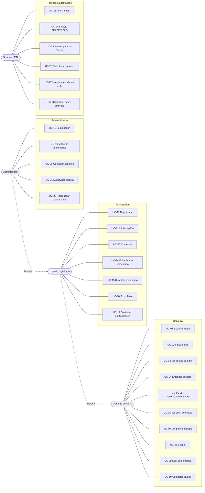

# Casos de Uso

> **Alcance:** describe cómo interactúan los actores con el sistema para cumplir los requerimientos
> funcionales. Se basa en [`2.requerimientos.md`](2.requerimientos.md) y se apoya en la
> [`1.arquitectura.md`](../2/1.arquitectura.md).
>
> **Convenciones:**
> - `UC-<n>` = Caso de Uso. Cada uno referencia los `RF-*` que satisface (ver trazabilidad, sección 7).
> - Prioridad según MoSCoW: M (mínimo para la demo), S (si hay tiempo), C (opcional).
> - El sistema usa siempre el lenguaje de "señales de riesgo" o "indicadores"; nunca formula acusaciones.

---

## 1. Actores

| Actor | Tipo | Descripción |
|---|---|---|
| **Visitante anónimo** | Primario | Ciudadano, periodista u organización de la sociedad civil sin cuenta. Consulta todo el contenido. |
| **Usuario registrado** | Primario | Visitante autenticado. Además comenta, se suscribe y recibe notificaciones. Hereda todo lo del visitante. |
| **Administrador** | Primario | Mantiene la plataforma: modera, gestiona usuarios y supervisa la ingesta de datos. |
| **Sistema / Procesos ETL** | Secundario | Procesos automáticos: ingesta de fuentes, extracción de partidas y cálculo de scores. |
| **Fuentes externas** | Secundario | INEI, SEACE/OCDS, INFOBRAS (PDF), Gemini, JNE y SUNAT. Proveen los datos. |

---

## 2. Diagrama de casos de uso

---

## 3. Casos de uso del visitante anónimo

### UC-01 · Explorar obras en el mapa — M
- **Actor:** Visitante anónimo
- **RF:** RF-MAP-01, RF-MAP-02, RF-MAP-03, RF-MAP-07, RF-G-02
- **Precondición:** Existen obras georreferenciadas con su score calculado.
- **Flujo principal:**
  1. El visitante abre la página principal.
  2. El sistema dibuja el mapa del Perú con un marcador por obra.
  3. Cada marcador toma el color de su nivel de riesgo (verde 0–40, amarillo 41–60, rojo 61–100).
  4. El sistema muestra la leyenda que explica la escala de color.
  5. El visitante hace clic en un marcador y se abre el detalle de la obra (UC-03).
- **Flujos alternativos:**
  - 2a. Si hay muchas obras cercanas, el sistema las agrupa (clustering, RF-MAP-06) y las separa al ampliar el zoom.
  - 3a. Si una obra no tiene coordenadas, no aparece en el mapa y se lista en un panel alternativo (RF-MAP-09).
- **Excepciones:**
  - 2b. Si no hay datos o falla la carga, se muestra un estado vacío o de error (RF-G-06).
- **Postcondición:** El visitante ve el panorama de obras y su nivel de riesgo.

### UC-02 · Filtrar obras — M
- **Actor:** Visitante anónimo
- **RF:** RF-MAP-04, RF-MAP-05, RF-MAP-08
- **Precondición:** El mapa está cargado (UC-01).
- **Flujo principal:**
  1. El visitante elige filtros por región o departamento, tipo de obra y estado de ejecución.
  2. El sistema actualiza los marcadores visibles según esos filtros.
  3. De forma opcional, muestra el total de obras visibles y su resumen por nivel de riesgo.
- **Flujos alternativos:**
  - 1a. Si el visitante filtra por nivel de riesgo (por ejemplo, solo las obras en rojo, ≥61), el mapa muestra únicamente esas.
  - 2a. Si ningún resultado coincide, se muestra un estado vacío con la opción de limpiar los filtros.
- **Postcondición:** El mapa refleja solo las obras que cumplen los filtros.

### UC-03 · Ver detalle de obra y sobreprecios — M
- **Actor:** Visitante anónimo
- **RF:** RF-OBR-01..06, RF-OBR-08, RF-OBR-09, RF-G-04, RF-G-05
- **Precondición:** La obra existe y tiene datos cargados.
- **Flujo principal:**
  1. El visitante selecciona una obra desde el mapa, la búsqueda o una lista.
  2. El sistema abre el detalle con el título, tipo, estado, ubicación y presupuesto total.
  3. Muestra el score de riesgo (0–100) con su semáforo.
  4. Muestra el desglose de partidas: insumo, unidad, cantidad y precio declarado frente al de referencia.
  5. Resalta las partidas con sobreprecio, según el ratio entre el precio declarado y el de referencia.
  6. Cita la fuente oficial de cada dato y su fecha de actualización.
  7. Muestra el descargo de responsabilidad: son señales de riesgo, no una acusación.
  8. Desde aquí el visitante puede ir al municipio y sus autoridades (UC-05) o a la empresa (UC-07).
- **Flujos alternativos:**
  - 4a. Si la obra se analizó por costo/m² (sin partidas legibles), el sistema indica ese modo de análisis (RF-OBR-10) y muestra la comparación a nivel de presupuesto total.
  - 4b. Si hay insumos sin precio de referencia, se marcan como "no comparable" (RF-SCO-10).
- **Excepciones:**
  - 2a. Si la obra no tiene PDF ni datos suficientes, se muestra lo disponible y se indican los datos faltantes (RF-G-06).
- **Postcondición:** El visitante entiende qué partidas elevan el riesgo de la obra.

### UC-04 · Entender el score (desglose explicativo) — M
- **Actor:** Visitante anónimo
- **RF:** RF-OBR-06, RF-G-03, RF-SCO-09
- **Precondición:** La obra tiene un score calculado y trazable.
- **Flujo principal:**
  1. En el detalle de la obra, el visitante abre el desglose del score.
  2. El sistema lista los indicadores que se activaron (sobrecostos, postor único, ampliaciones, desfase, entre otros).
  3. Muestra cuánto aporta cada indicador al score total, sin cajas negras.
- **Postcondición:** El visitante puede explicar por qué la obra obtuvo ese score.

### UC-05 · Ver municipio y autoridades — M
- **Actor:** Visitante anónimo
- **RF:** RF-MUN-01, RF-MUN-02, RF-MUN-03, RF-MUN-04, RF-MUN-05
- **Precondición:** La obra tiene una entidad ejecutora asociada.
- **Flujo principal:**
  1. Desde el detalle de la obra, el visitante abre el municipio o entidad responsable.
  2. El sistema muestra el nombre y los datos del municipio.
  3. Lista al alcalde y los regidores del período.
  4. De forma opcional, muestra el resumen de obras del municipio con su riesgo agregado y el indicador de concentración de contratistas.
  5. El visitante hace clic en una autoridad y abre su perfil (UC-06).
- **Postcondición:** El visitante conoce la entidad y sus autoridades.

### UC-06 · Ver perfil de autoridad (acotado) — S
- **Actor:** Visitante anónimo
- **RF:** RF-AUT-01, RF-AUT-02, RF-AUT-03, RF-AUT-04
- **Precondición:** La autoridad existe en el dataset del JNE.
- **Flujo principal:**
  1. El visitante abre el perfil de un alcalde o regidor.
  2. El sistema muestra solo datos públicos del JNE: nombre, cargo, partido y período (sin DNI).
  3. Muestra la foto si la fuente la provee.
  4. Lista las obras bajo su gestión con su score de riesgo agregado.
  5. Muestra el descargo: es información pública con fines de transparencia, sin juicio sobre la persona.
- **Restricción:** El sistema no muestra denuncias ni procesos judiciales (decisión ética, Opción B).
- **Postcondición:** El visitante ve el contexto cívico de la obra sin afirmaciones sobre la persona.

### UC-07 · Ver perfil de empresa contratista — M
- **Actor:** Visitante anónimo
- **RF:** RF-EMP-01, RF-EMP-02, RF-EMP-03, RF-EMP-08, RF-G-03
- **Precondición:** La empresa existe en SEACE/SUNAT y tiene historial.
- **Flujo principal:**
  1. El visitante abre el perfil de la empresa adjudicada.
  2. El sistema muestra los datos básicos: razón social, RUC, representante legal y estado SUNAT.
  3. Muestra el score de confiabilidad de la empresa (0–100) con su semáforo.
  4. Lista las obras que se le adjudicaron antes: cuántas, en qué municipios y por qué montos.
  5. Cada alerta y cada score se puede rastrear hasta su dato de origen.
- **Flujos alternativos:**
  - 4a. (S) El sistema muestra la tasa de obras completadas frente a abandonadas, y si la empresa trabaja siempre con el mismo municipio.
  - 4b. (S) Muestra alertas: varias obras sobrevaluadas, RUC reciente con contratos grandes, o el mismo representante legal que otras empresas ganadoras.
  - 4c. (C) Muestra sanciones externas por RUC (OSCE/SEACE, deuda coactiva SUNAT, OEFA).
- **Postcondición:** El visitante conoce el historial y las señales de riesgo de la empresa.

### UC-08 · Buscar — S
- **Actor:** Visitante anónimo
- **RF:** RF-G-08
- **Flujo principal:**
  1. El visitante escribe un término: una obra, un municipio, una empresa (por RUC o razón social) o una autoridad.
  2. El sistema devuelve las coincidencias agrupadas por tipo.
  3. El visitante elige un resultado y se abre la vista correspondiente (UC-03, UC-05, UC-06 o UC-07).
- **Excepciones:** 2a. Si no hay coincidencias, se muestra un mensaje de "sin resultados".

### UC-09 · Leer comentarios — M
- **Actor:** Visitante anónimo
- **RF:** RF-COM-01, RF-COM-07
- **Flujo principal:**
  1. En cualquier recurso (obra, empresa, municipio o autoridad), el visitante ve la sección de comentarios.
  2. El sistema muestra cada comentario con su autor (alias), fecha y contenido.
  3. Si el visitante intenta comentar, el sistema lo invita a registrarse o iniciar sesión (UC-11 o UC-12).
- **Postcondición:** El visitante lee la conversación sin necesidad de cuenta.

### UC-10 · Compartir una página — S
- **Actor:** Visitante anónimo
- **RF:** RF-G-09, RNF-13
- **Flujo principal:**
  1. El visitante copia la URL propia del recurso o usa el botón de compartir.
  2. Al compartirlo en redes, el sistema entrega los metadatos Open Graph (título, score y descripción).
- **Postcondición:** El recurso se comparte con una vista previa enriquecida.

---

## 4. Casos de uso del usuario registrado

### UC-11 · Registrarse — M
- **Actor:** Visitante anónimo que pasa a usuario registrado
- **RF:** RF-USR-01, RNF-08, RNF-10
- **Precondición:** El visitante no tiene cuenta.
- **Flujo principal:**
  1. El visitante elige "Registrarse".
  2. Ingresa su correo y contraseña, o usa un proveedor externo como Google.
  3. El sistema valida los datos, guarda la contraseña cifrada y crea la cuenta con rol `registrado`.
  4. El sistema inicia la sesión y lo devuelve a donde estaba.
- **Excepciones:**
  - 2a. Si el correo ya está registrado, se muestra un error con la opción de iniciar sesión.
  - 2b. Si los datos son inválidos o la contraseña es débil, se valida con un mensaje (RNF-11).
- **Postcondición:** Existe una cuenta activa con rol `registrado`.

### UC-12 · Iniciar y cerrar sesión, recuperar contraseña — M
- **Actor:** Usuario registrado
- **RF:** RF-USR-02, RNF-08
- **Flujo principal:**
  1. El usuario ingresa sus credenciales; el sistema las valida y abre una sesión segura.
  2. El usuario puede cerrar la sesión en cualquier momento.
- **Flujos alternativos:**
  - 1a. Si olvidó la contraseña, solicita recuperarla y el sistema le envía un enlace por correo.
- **Excepciones:** 1b. Si las credenciales son inválidas, el mensaje no revela qué campo falló.
- **Postcondición:** La sesión queda iniciada o cerrada, según la acción.

### UC-13 · Publicar comentario — M
- **Actor:** Usuario registrado
- **RF:** RF-COM-02, RF-COM-07
- **Precondición:** El usuario tiene la sesión iniciada.
- **Flujo principal:**
  1. En un recurso (obra, empresa, municipio o autoridad), el usuario escribe y publica un comentario.
  2. El sistema valida el contenido y lo asocia al recurso y al autor.
  3. El comentario aparece con el alias, la fecha y el contenido.
- **Flujos alternativos:**
  - 1a. (C) Si el usuario responde a otro comentario, se crea un hilo anidado (RF-COM-05).
- **Excepciones:**
  - 1b. Sin sesión, se lo redirige a iniciar sesión (UC-12).
  - 1c. Si el contenido está vacío o es abusivo, se aplica validación y límite de frecuencia (RNF-11).
- **Postcondición:** El comentario queda publicado y visible para todos.

### UC-14 · Editar o eliminar el propio comentario — S
- **Actor:** Usuario registrado
- **RF:** RF-COM-03
- **Precondición:** El usuario es el autor del comentario.
- **Flujo principal:** El usuario edita o elimina su comentario y el sistema aplica el cambio.
- **Excepciones:** Si no es el autor, la acción no está disponible.

### UC-15 · Reportar un comentario — S
- **Actor:** Usuario registrado
- **RF:** RF-COM-06
- **Flujo principal:**
  1. El usuario reporta un comentario que considera inapropiado.
  2. El sistema lo marca y lo envía a la cola de moderación del administrador (UC-19).
- **Postcondición:** El comentario queda pendiente de revisión.

### UC-16 · Suscribirse a un recurso — S
- **Actor:** Usuario registrado
- **RF:** RF-USR-03
- **Flujo principal:**
  1. El usuario se suscribe a una obra, empresa, municipio o autoridad.
  2. El sistema registra la suscripción para enviarle notificaciones más adelante (UC-17).
- **Postcondición:** El usuario queda siguiendo el recurso.

### UC-17 · Recibir y gestionar notificaciones — S
- **Actor:** Usuario registrado
- **RF:** RF-USR-04, RF-USR-05, RF-USR-06
- **Precondición:** El usuario tiene al menos una suscripción.
- **Flujo principal:**
  1. Ocurre una novedad en un recurso que sigue: un nuevo comentario, un cambio de score o una nueva alerta.
  2. El sistema genera una notificación en el centro de notificaciones (la campana).
  3. El usuario la lee, la marca como leída y puede revisar su historial.
- **Flujos alternativos:**
  - 3a. (C) El usuario configura qué notificaciones quiere recibir (RF-USR-05).
  - 2a. (S) La notificación también puede llegar por correo (RF-USR-06).
- **Postcondición:** El usuario se mantiene informado de lo que sigue.

---

## 5. Casos de uso del administrador

### UC-18 · Iniciar sesión como administrador — M
- **Actor:** Administrador
- **RF:** RF-ADM-01, RNF-09
- **Flujo principal:** El administrador inicia sesión con rol elevado y accede al backoffice restringido.
- **Excepciones:** Si el usuario no tiene rol de administrador, se le niega el acceso al backoffice (RNF-09).

### UC-19 · Moderar comentarios reportados — S
- **Actor:** Administrador
- **RF:** RF-ADM-02
- **Precondición:** Hay comentarios en la cola de reportes (UC-15).
- **Flujo principal:**
  1. El administrador revisa la cola de comentarios reportados.
  2. Decide ocultar o eliminar el contenido inapropiado, o descartar el reporte.
- **Postcondición:** El contenido inapropiado deja de mostrarse.

### UC-20 · Gestionar usuarios — S
- **Actor:** Administrador
- **RF:** RF-ADM-03
- **Flujo principal:** El administrador suspende o elimina las cuentas que incumplen las reglas.
- **Postcondición:** La cuenta queda suspendida o eliminada.

### UC-21 · Supervisar la ingesta de datos — S
- **Actor:** Administrador
- **RF:** RF-ADM-04, RF-ADM-06
- **Flujo principal:**
  1. El administrador abre el tablero de estado del sistema.
  2. El sistema muestra la salud de cada fuente, la fecha de última actualización, las cuotas de API restantes y los últimos errores.
- **Postcondición:** El administrador conoce el estado operativo de la ingesta.

### UC-22 · Reprocesar datos o recalcular scores — C
- **Actor:** Administrador
- **RF:** RF-ADM-05
- **Flujo principal:** El administrador dispara manualmente una actualización de datos o un recálculo de scores, y el sistema ejecuta el proceso correspondiente (UC-25, UC-26 o UC-28).
- **Postcondición:** Los datos y los scores quedan actualizados.

---

## 6. Casos de uso del sistema (procesos automáticos)

### UC-23 · Ingestar precios de referencia del INEI (ETL) — M
- **Actor:** Sistema (programado, mensual)
- **RF:** RF-SCO-02, RF-SCO-11, RNF-05
- **Flujo principal:**
  1. El proceso revisa si hay un nuevo `.xlsx` de Índices Unificados en el INEI.
  2. Si lo hay, lo descarga, lo procesa y actualiza la tabla `precios_referencia`.
  3. Registra la versión y la fecha de la tabla utilizada.
- **Flujos alternativos:** 1a. Si no hay un índice nuevo, mantiene el del mes anterior.

### UC-24 · Ingestar metadatos de obra (SEACE/OCDS) — M
- **Actor:** Sistema (programado o bajo demanda)
- **RF:** RF-OBR-01, RF-OBR-02, RF-EMP-01, RF-EMP-03, RF-G-04
- **Flujo principal:**
  1. El proceso consulta la API OCDS por rango de fechas o por entidad.
  2. Extrae la obra (título, monto, ubicación y estado), el contratista (RUC y razón social) y la entidad.
  3. Obtiene o geocodifica las coordenadas y actualiza las tablas `obras`, `contratistas` y `contratos`.
- **Excepciones:** Si la API falla, usa el dato en caché y registra el error (RNF-05, RNF-06).

### UC-25 · Extraer partidas del expediente con Gemini — M
- **Actor:** Sistema (bajo demanda, en la primera consulta de la obra)
- **RF:** RF-SCO-01, RF-SCO-08, RF-OBR-10
- **Precondición:** Existe la URL del PDF del expediente en INFOBRAS.
- **Flujo principal:**
  1. Descarga el PDF y lo envía a Gemini con un prompt estructurado.
  2. Recibe un JSON con las partidas (insumo, unidad, cantidad y precio unitario).
  3. Valida los campos y los rangos esperados; si están correctos, los inserta en `partidas_obra`.
  4. Guarda la respuesta original en `log_extraccion` para auditoría y cachea el resultado.
- **Flujos alternativos y excepciones:**
  - 1a. Si el PDF no está disponible o no es legible, marca la obra para el modo costo/m² (UC-26, RF-SCO-08).
  - 3a. Si se excede la cuota de Gemini, cae al modo costo/m² y registra el evento.
- **Postcondición:** La obra tiene sus partidas estructuradas o queda marcada para el modo costo/m².

### UC-26 · Calcular el score de riesgo de la obra — M
- **Actor:** Sistema
- **RF:** RF-SCO-03, RF-SCO-04, RF-SCO-05, RF-SCO-06, RF-SCO-09, RF-SCO-10
- **Precondición:** La obra tiene partidas (UC-25) o entra por el modo costo/m².
- **Flujo principal:**
  1. Empareja cada partida con su insumo de referencia por código estandarizado.
  2. Calcula el ratio de cada partida (precio declarado entre precio de referencia).
  3. Calcula el score global (0–100) como promedio ponderado.
  4. Lo clasifica en el semáforo (verde, amarillo o rojo) y guarda el desglose explicativo.
- **Flujos alternativos:**
  - 1a. Si un insumo no tiene referencia, se marca como "no comparable" y no afecta el score (RF-SCO-10).
  - Pre-1. Si la obra va por el modo costo/m², compara el presupuesto total según el tipo de obra y el metrado (RF-SCO-08).
- **Postcondición:** La obra queda con su score y su desglose guardados, que alimentan UC-03 y UC-04.

### UC-27 · Ingestar autoridades (JNE) — S
- **Actor:** Sistema (programado, semanal)
- **RF:** RF-MUN-02, RF-AUT-01, RF-AUT-02
- **Flujo principal:** Descarga el dataset de autoridades del JNE, lo procesa y actualiza la tabla `autoridades`, vinculando cada una a su entidad y período.

### UC-28 · Calcular el score de confiabilidad de la empresa — S
- **Actor:** Sistema
- **RF:** RF-EMP-02, RF-EMP-04, RF-EMP-05, RF-EMP-06
- **Flujo principal:** A partir del historial del contratista (obras, montos, adicionales y reincidencia con un mismo municipio), calcula su score (0–100) y sus alertas de forma explicable.
- **Postcondición:** La empresa queda con su score y sus alertas trazables, que alimentan UC-07.

---

## 7. Trazabilidad Caso de uso ↔ Requerimiento

| Caso de uso | RF cubiertos | Prioridad |
|---|---|---|
| UC-01 Explorar mapa | RF-MAP-01/02/03/07, RF-G-02 | M |
| UC-02 Filtrar obras | RF-MAP-04/05/08 | M |
| UC-03 Ver detalle de obra | RF-OBR-01..06/08/09, RF-G-04/05 | M |
| UC-04 Entender el score | RF-OBR-06, RF-G-03, RF-SCO-09 | M |
| UC-05 Municipio y autoridades | RF-MUN-01..05 | M |
| UC-06 Perfil de autoridad | RF-AUT-01..04 | S |
| UC-07 Perfil de empresa | RF-EMP-01/02/03/08 (+04/05/06/07) | M |
| UC-08 Buscar | RF-G-08 | S |
| UC-09 Leer comentarios | RF-COM-01/07 | M |
| UC-10 Compartir página | RF-G-09, RNF-13 | S |
| UC-11 Registrarse | RF-USR-01 | M |
| UC-12 Iniciar sesión | RF-USR-02 | M |
| UC-13 Comentar | RF-COM-02/05/07 | M |
| UC-14 Editar/borrar comentario | RF-COM-03 | S |
| UC-15 Reportar comentario | RF-COM-06 | S |
| UC-16 Suscribirse | RF-USR-03 | S |
| UC-17 Notificaciones | RF-USR-04/05/06 | S |
| UC-18 Login admin | RF-ADM-01 | M |
| UC-19 Moderar comentarios | RF-ADM-02 | S |
| UC-20 Gestionar usuarios | RF-ADM-03 | S |
| UC-21 Supervisar ingesta | RF-ADM-04/06 | S |
| UC-22 Reprocesar datos | RF-ADM-05 | C |
| UC-23 Ingesta INEI | RF-SCO-02/11 | M |
| UC-24 Ingesta SEACE/OCDS | RF-OBR-01/02, RF-EMP-01/03, RF-G-04 | M |
| UC-25 Extraer partidas Gemini | RF-SCO-01/08, RF-OBR-10 | M |
| UC-26 Calcular score obra | RF-SCO-03..06/09/10 | M |
| UC-27 Ingesta autoridades JNE | RF-MUN-02, RF-AUT-01/02 | S |
| UC-28 Calcular score empresa | RF-EMP-02/04/05/06 | S |

El recorrido mínimo para la demostración encadena los procesos automáticos UC-23, UC-24, UC-25 y
UC-26, que dejan los datos y los scores listos. Sobre esa base, el visitante recorre UC-01, UC-03,
UC-04 y luego UC-05 o UC-07, y la participación se muestra con el registro o inicio de sesión
(UC-11, UC-12) seguido de un comentario (UC-13).
