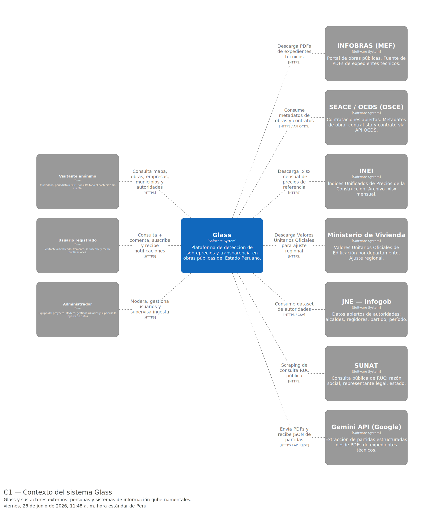
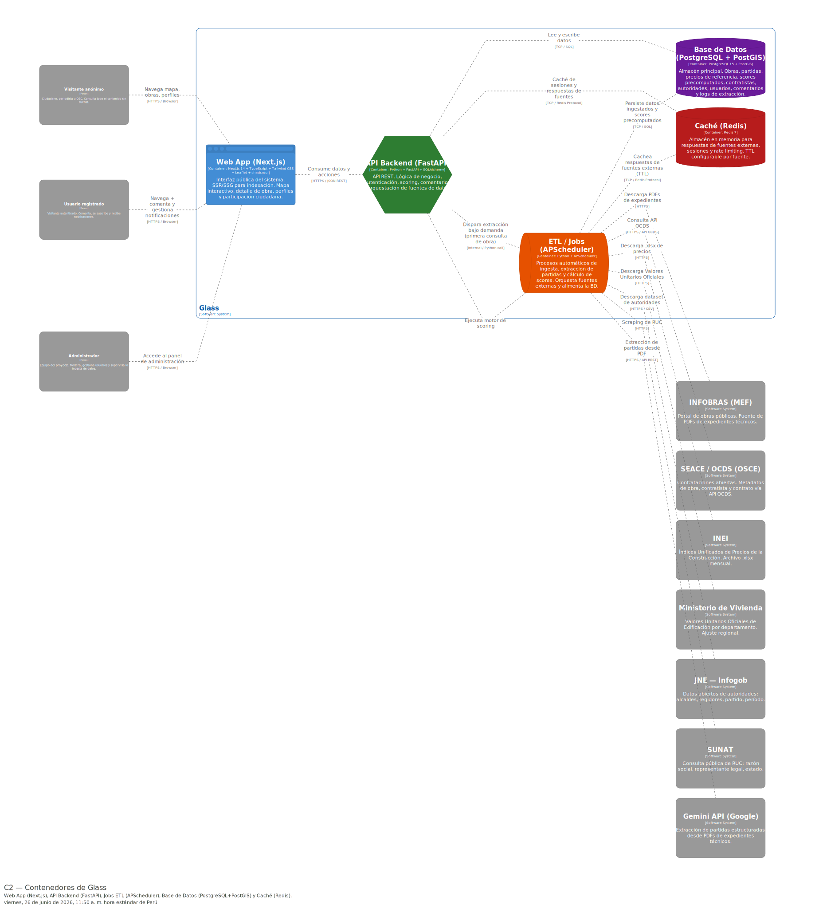
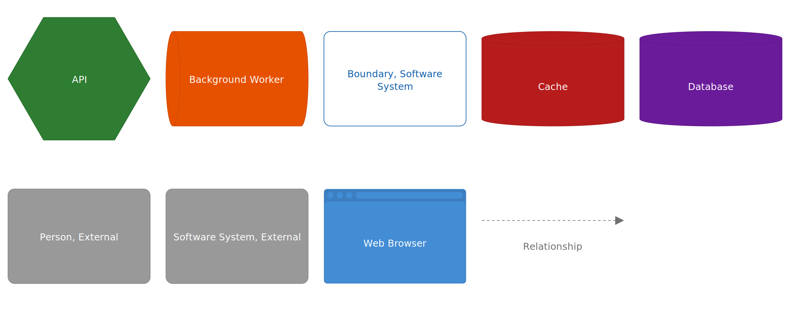

# Arquitectura

---

## 1. Visión general

Glass está organizado como una arquitectura por capas con cinco contenedores bien diferenciados: la
aplicación web, la API, los procesos de ingesta, la base de datos y la caché. La idea que guía todo el
diseño es sencilla: el trabajo pesado (descargar documentos, extraer partidas y calcular scores) ocurre
fuera del camino que recorre el ciudadano cuando consulta una obra. Cuando alguien abre el mapa o entra
al detalle de una obra, la información ya está calculada y almacenada, de modo que la respuesta es
inmediata y no depende de que las fuentes externas estén disponibles en ese instante.

Tres decisiones sostienen esta organización. La primera es separar la lectura (la consulta pública) del
procesamiento (la ingesta programada), de manera que el uso diario nunca compita con las tareas de
actualización. La segunda es aislar cada fuente externa detrás de una misma interfaz, para poder cambiar
una fuente sin tocar la lógica de negocio. La tercera es precomputar los scores, para que el sistema
responda rápido y siga funcionando aunque una fuente falle.

---

## 2. Diagramas C4

Documentamos la arquitectura con el modelo C4 en dos niveles: el contexto del sistema (con quién se
relaciona) y los contenedores (de qué piezas se compone por dentro).

### Nivel 1 — Contexto

### Nivel 2 — Contenedores

---

## 3. Descripción de los componentes

### Aplicación web (Next.js)

Es la cara del producto y la única pieza con la que interactúa el ciudadano. Reúne el mapa de obras, el
detalle con el desglose del score, los perfiles de empresa, municipio y autoridad, el buscador y la zona
de participación (comentarios y notificaciones). Elegimos Next.js porque renderiza en el servidor, lo que
permite que cada obra y cada empresa tengan una página indexable por buscadores (RNF-12); ese punto es
importante para que la plataforma sea encontrable y genere confianza. El mapa se apoya en Leaflet y la
interfaz en componentes de shadcn/ui. El acceso de lectura es público y la cuenta solo se pide para
comentar o suscribirse (ADR-010).

### API backend (FastAPI)

Concentra la lógica de negocio y es el único punto por el que la web obtiene datos. Expone endpoints REST
para obras, empresas, municipios, autoridades, comentarios, suscripciones, autenticación y administración.
Aquí vive el motor de scoring, que calcula y explica el riesgo de cada obra de forma determinista, y la
capa de abstracción de fuentes de datos. Optamos por FastAPI porque es asíncrono de forma nativa, lo que
ayuda cuando hay que llamar a varios servicios externos sin bloquear, y porque genera la documentación
OpenAPI de manera automática, lo que agiliza el trabajo conjunto con el frontend (ADR-003).

### Procesos de ingesta / ETL (APScheduler)

Son los procesos que mantienen la base de datos al día. Cada fuente tiene su propia cadencia: el INEI
publica precios cada mes, SEACE se actualiza a diario y el JNE de forma semanal, así que la sincronización
se programa según ese ritmo. Las partidas del expediente son un caso aparte: como INFOBRAS no las expone
de forma estructurada, se extraen del PDF con Gemini la primera vez que se consulta una obra, y el
resultado se guarda para no repetir el proceso (ADR-001, ADR-002). Usamos APScheduler en lugar de una
herramienta más pesada como Celery porque, para el volumen del proyecto, una programación periódica simple
es suficiente.

### Base de datos (PostgreSQL + PostGIS)

Es el almacén central: obras, partidas, precios de referencia, scores ya calculados, contratistas,
autoridades, usuarios, comentarios y los registros de extracción. Elegimos PostgreSQL con la extensión
PostGIS porque el mapa necesita consultas geográficas eficientes (qué obras caen dentro del área visible,
agrupación por cercanía) y PostGIS es la opción más madura para ese tipo de operaciones. Al mismo tiempo,
PostgreSQL nos da las garantías transaccionales que requieren las cuentas y las suscripciones (ADR-006).

### Caché (Redis)

Guarda en memoria las respuestas de las fuentes externas, las sesiones y los contadores de límite de
frecuencia. Cada fuente tiene un tiempo de vida acorde a su cadencia de actualización. Si una fuente deja
de responder, el sistema sirve el último dato disponible e indica su fecha, de modo que la aplicación
nunca queda en blanco (ADR-007). Esta caché es además una de las piezas que sostienen la disponibilidad
durante la evaluación.

---

## 4. Stack tecnológico

El stack se eligió buscando un equilibrio entre lo que pide cada capa y el tiempo disponible para construir
la primera versión.

| Capa | Tecnología | Versión | Justificación |
|---|---|---|---|
| Frontend | Next.js | 14 (App Router) | SSR para SEO (RNF-12), Leaflet para mapas, shadcn/ui para componentes. |
| Backend | FastAPI | 0.110+ | Asíncrono nativo (llamadas a Gemini, SEACE, scraping), OpenAPI auto. |
| Base de datos | PostgreSQL + PostGIS | 15+ | Datos geoespaciales (obras por ubicación), consultas espaciales nativas, ACID. |
| Cache | Redis / en memoria | — | Límites de API externas (RNF-05), TTL configurable por fuente. |
| ETL | APScheduler | — | Sincronización periódica simple (Celery es excesivo para el alcance actual). |
| Extracción PDF | Gemini API | — | Modelo de IA para extraer partidas de PDFs escaneados y con texto (ADR-001). |

---

## 5. Atributos de calidad

El diseño se ordena alrededor de los atributos de calidad prioritarios. La tabla resume la táctica
principal de cada uno; el análisis y los escenarios completos están en
[`4.atributos-calidad.md`](../1/4.atributos-calidad.md).

| Prioridad | Atributo | Táctica principal |
|---|---|---|
| Alta | Mantenibilidad | `DataSource` interface + ADR documentados |
| Alta | Disponibilidad | Scores precomputados + caché con degradación elegante |
| Alta | Usabilidad | Semáforo 0-100 + desglose explicativo del score |
| Media | Rendimiento | Scores precomputados + clustering de marcadores |
| Media | Seguridad | Roles de acceso + rate limiting + secretos fuera del cliente |
| Baja | Escalabilidad | Backend stateless + ETL batch |

---

## 6. Decisiones arquitectónicas

Cada decisión relevante quedó registrada como un ADR, con su contexto, las alternativas evaluadas y el
motivo de la elección. El texto completo de cada una está en [`docs/adr/adr.md`](../../docs/adr/adr.md).

| ID | Título | Categoría |
|---|---|---|
| ADR-001 | Gemini API para extracción de partidas desde PDFs | Elección de Tecnología |
| ADR-002 | Ingesta programada de fuentes externas mediante ETL batch | Modelo de Coordinación |
| ADR-003 | Stack tecnológico: Next.js + FastAPI + PostgreSQL/PostGIS | Elección de Tecnología |
| ADR-004 | Abstracción de fuentes externas mediante DataSource Interface | Asignación de Responsabilidades |
| ADR-005 | Scores precomputados en pipeline ETL vs cálculo en tiempo real | Modelo de Coordinación |
| ADR-006 | PostgreSQL con PostGIS como motor de base de datos | Modelo de Datos |
| ADR-007 | Caché con TTL y degradación elegante para fuentes externas | Gestión de Recursos |
| ADR-008 | Monorepo con frontend y backend en un solo repositorio | Mapeo entre Elementos Arquitectónicos |
| ADR-009 | Configuración y credenciales resueltas en tiempo de ejecución | Tiempo de Enlace |
| ADR-010 | Modelo de usuarios tipo YouTube (acceso público sin login) | Asignación de Responsabilidades |

---
