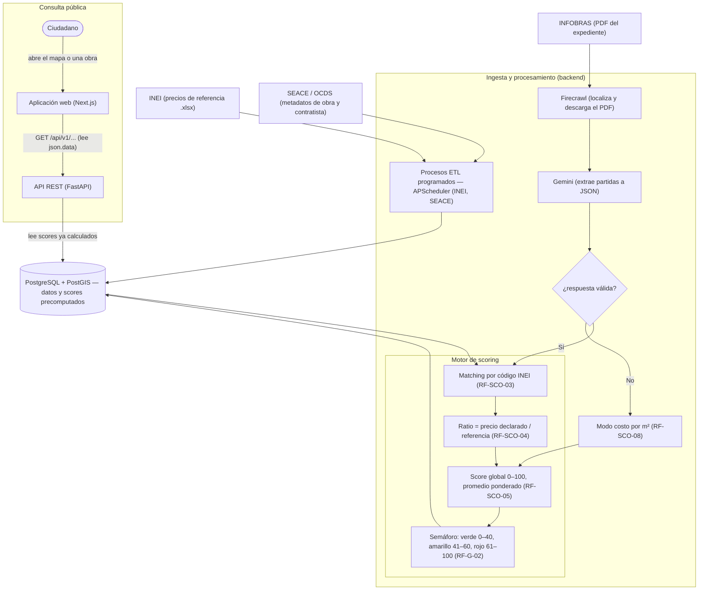

# Flujo de Datos

> **Alcance:** describe el flujo de datos del motor de scoring, los pipelines de ingesta de cada fuente externa y cómo el frontend consume la información.
>
> **Referencias:** [`1.arquitectura.md`](1.arquitectura.md) · [`3.modelo-datos.md`](3.modelo-datos.md) · [`../../docs/adr/adr.md`](../../docs/adr/adr.md)

---

## 1. Flujo general de datos

El siguiente diagrama resume el recorrido de los datos, desde su origen en las fuentes públicas, pasando por la ingesta y el cálculo del score, hasta su consulta por el ciudadano.



La extracción de partidas (rama de INFOBRAS) no es automática al abrir una obra: se dispara con una **solicitud de extracción** (`POST /api/v1/obras/extraer`), que ejecuta el pipeline Firecrawl → Gemini → scoring. Las ramas de INEI y SEACE sí corren de forma programada.

---

## 2. Pipelines de ingesta

### 2.1 INEI — Precios de referencia

```
Programación: mensual (job cron de APScheduler, día 1)
Estado: parcial — la resolución de la URL del .xlsx está pendiente (TODO).

1. Resolver la URL del último .xlsx de Índices Unificados en inei.gob.pe
2. Descargar el archivo → parsear con openpyxl
3. Upsert a la tabla `precios_referencia` (fuente = 'inei')
4. Registrar el resultado en `log_extraccion` (RF-SCO-11)
```

> Nota: el job está programado, pero la función que obtiene la URL del índice (`_obtener_url_ultimo_indice`) todavía no scrapea inei.gob.pe; por ahora la URL se provee de forma manual.

### 2.2 SEACE / OCDS — Metadatos de obra

```
Programación: cada 24 h (job de APScheduler) o bajo demanda.

1. Consultar la API OCDS (`/api/ocds/records`) por una consulta de texto
2. Por cada release: extraer obra (título, monto, estado, tipo inferido del título),
   contratista (RUC, razón social) y entidad ejecutora
3. Crear o reutilizar el contratista y la entidad
4. Upsert a las tablas `obras`, `contratistas` y `entidades`
```

> El tipo de obra se infiere por palabras clave del título (carretera, agua/saneamiento, salud, educación, edificación). La geocodificación de coordenadas todavía no está implementada.

### 2.3 INFOBRAS — Partidas del expediente (Firecrawl + Gemini)

```
Disparador: solicitud bajo demanda (POST /api/v1/obras/extraer).

1. Firecrawl scrapea la ficha de la obra en INFOBRAS y localiza la URL del PDF
2. Firecrawl descarga el PDF (bytes en crudo)
3. Gemini recibe el PDF y devuelve un array JSON de partidas con prompt estructurado:
   "Extrae la tabla de partidas del expediente. Devuelve un array JSON con
    objetos {insumo, unidad, cantidad, precio_unitario}."
4. Validación: que la respuesta sea una lista de partidas con los campos esperados
   (la validación por rangos de precio está prevista, aún no implementada)
5. Insertar las partidas en `partidas_obra` y registrar la extracción en `log_extraccion`
6. Calcular el score de la obra. Si la descarga o la extracción fallan, la obra
   queda en modo costo/m² (RF-SCO-08)
```

> Hoy `log_extraccion.respuesta_cruda` guarda un resumen de la extracción (número de partidas), no el JSON completo de Gemini. Almacenar la respuesta cruda íntegra para auditoría queda pendiente (ver ADR-001).

### 2.4 JNE — Autoridades *(planeado, no implementado)*

```
Programación prevista: semanal.

1. Descargar el dataset de autoridades del JNE (datosabiertos.gob.pe)
2. Parsear CSV/XLSX → upsert a la tabla `autoridades`
3. Vincular cada autoridad con su entidad y período
```

> Aún no existe el datasource ni el job programado de JNE. La tabla `autoridades` se puebla manualmente por ahora.

---

## 3. Estado y estrategia de actualización

| Fuente | Cadencia | Disparador | Estado | Respaldo si falla |
|---|---|---|---|---|
| INEI — Precios de referencia | Mensual | Job cron (APScheduler) | Parcial (URL del .xlsx pendiente) | Últimos datos cargados |
| SEACE/OCDS — Metadatos | Cada 24 h | Job de APScheduler / manual | Implementado | Último dato en BD |
| INFOBRAS — Partidas (Firecrawl + Gemini) | Bajo demanda | `POST /obras/extraer` | Implementado | Modo costo/m² (RF-SCO-08) |
| JNE — Autoridades | Semanal (prevista) | — | Planeado | Carga manual |
| SUNAT — RUC | Bajo demanda (prevista) | — | Planeado | — |
| Poder Judicial — Denuncias | Exploratorio | Manual | No contemplado en el MVP | — |

> La capa de caché con TTL por fuente (Redis) está prevista en la arquitectura (ADR-007) pero aún no está cableada en los datasources. La disponibilidad durante la consulta se sostiene hoy con los **scores y datos precomputados en la base de datos**: el frontend nunca consulta una fuente externa en vivo.

---

## 4. Modelo de precios de referencia

### 4.1 INEI — Precios nacionales (fuente primaria)

Los **Índices Unificados de Precios de la Construcción (IUPC)** que publica el INEI mensualmente son **índices de precios** (variación porcentual respecto a un año base), no precios absolutos en S/. Adicionalmente, el INEI publica cuadros de **precios absolutos por insumo** (cemento, acero, agregados, mano de obra, etc.) a nivel **nacional**.

| Aspecto | Detalle |
|---|---|
| Cobertura geográfica | **Nacional** (no disponible por departamento para materiales individuales) |
| Formato | .xlsx descargable |
| Cadencia | Mensual |
| Contenido | Precios unitarios absolutos en S/ por insumo (cemento, fierro, madera, etc.) |

El motor de scoring compara el precio declarado en la partida contra el precio nacional INEI. En la UI se indica claramente: *"Precio de referencia: nacional (INEI)"* para que el usuario entienda el contexto.

### 4.2 Ministerio de Vivienda — Costo/m² por departamento (fallback regional)

El **Ministerio de Vivienda, Construcción y Saneamiento (MVCS)** publica anualmente los **Valores Unitarios Oficiales de Edificación** con costos por metro cuadrado de construcción **por departamento** (24 departamentos). Estos valores cubren:

- Costo por m² según tipo de edificación (vivienda, local comercial, etc.)
- Diferencias regionales por departamento
- Actualización anual

Se usan en el fallback RF-SCO-08 para comparar el presupuesto total de la obra contra el costo regional esperado.

> La carga automática de los Valores Unitarios aún no está implementada; hoy los costos por m² y los factores regionales viven como datos semilla en el código (`MviviendaDataSource`).

### 4.3 Factores de ajuste regional (contexto visual)

Para contextualizar los precios nacionales, se usan **factores de ajuste** basados en la relación entre el Valor Unitario Oficial de cada departamento y el de Lima. Estos factores **no modifican el score**; solo se muestran en el desglose explicativo.

| Departamento | Factor vs. Lima | Interpretación |
|---|---|---|
| Lima | 1.00 | Base nacional |
| Callao | 1.02 | Similar a Lima |
| Arequipa | 1.05 | Ligeramente superior |
| Ica | 1.03 | Similar |
| Cusco | 1.12 | Mayor costo logístico |
| Junín | 1.08 | |
| Piura | 1.06 | |
| La Libertad | 1.04 | |
| Cajamarca | 1.18 | |
| Huancavelica | 1.25 | Significativamente mayor |
| Ayacucho | 1.20 | Mayor costo por aislamiento |
| Loreto | 1.35 | Costo elevado (transporte fluvial) |
| Madre de Dios | 1.40 | Mayor del país |
| Ucayali | 1.30 | |
| Amazonas | 1.28 | |
| San Martín | 1.22 | |
| Pasco | 1.20 | |
| Tumbes | 1.10 | |
| Lambayeque | 1.04 | |
| Moquegua | 1.05 | |
| Tacna | 1.05 | |
| Puno | 1.15 | |
| Huánuco | 1.18 | |
| Apurímac | 1.25 | |

*Nota: estos factores son estimados a partir de los Valores Unitarios Oficiales. Se actualizan con cada nueva publicación del MVCS.*

### 4.4 Cálculo del score

**Resolución del precio de referencia por partida:**

```
precio_referencia_a_usar =
  IF existe un precio para el insumo en el departamento de la obra:
      precio_regional               ← prioridad 1
  ELSE IF existe un precio nacional del insumo:
      precio_nacional               ← prioridad 2 (caso real más común)
  ELSE:
      NULL → la partida se marca "no comparable" (RF-SCO-10)

ratio_partida = precio_declarado / precio_referencia_a_usar
```

> La prioridad 1 (precio regional) está prevista en el código, pero como el INEI solo entrega precios **nacionales** por insumo, en la práctica casi siempre se usa la prioridad 2. El ajuste regional efectivo proviene del fallback MVCS (costo/m²) y de los factores de contexto, no de un "precio INEI por departamento".

**Score global de la obra:**

```
score = (promedio de los ratios, ponderado por la cantidad de cada partida − 1) × 100
score acotado al rango 0–100

# El factor regional NO entra en este cálculo; es solo contexto visual.
# Una partida se marca como alerta cuando su ratio ≥ 1.3.
```

> Pendiente de mejora: la ponderación se hace hoy por la **cantidad** física de cada partida, lo que mezcla unidades distintas (bolsas, kg, m³). Se evalúa ponderar por **valor económico** (cantidad × precio) para reflejar mejor la materialidad de cada partida en el presupuesto.

### 4.5 Estrategia de precios (resumen)

| Fuente | Tipo de dato | Cobertura | Uso en scoring |
|---|---|---|---|
| INEI — IUPC | Precios absolutos por insumo (S/) | **Nacional** | Score primario por partida |
| Ministerio de Vivienda — VUO | Costo/m² por tipo de obra (S/) | **Por departamento** | Fallback RF-SCO-08 |
| Factores de ajuste | Factor adimensional | Estimado por departamento | Contexto visual en el desglose |

---

## 5. Consulta desde el frontend

La aplicación web (Next.js) consume la API REST del backend y nunca habla con las fuentes externas en vivo. Todas las respuestas siguen el formato `{ "data": ..., "error": ... }`, y el cliente lee el campo `data`.

| Vista | Endpoints que consume |
|---|---|
| Mapa y listado de obras | `GET /obras` |
| Detalle de obra | `GET /obras/{id}` y `GET /obras/{id}/score` |
| Perfil de empresa | `GET /empresas/{id}` y `GET /empresas/{id}/obras` |
| Municipio y sus obras | `GET /municipios/{id}` y `GET /municipios/{id}/obras` |
| Perfil de autoridad | `GET /autoridades/{id}` |

Para mostrar el PDF del expediente sin problemas de CORS, el frontend expone un proxy propio (`GET /api/pdf?url=...`) que descarga el documento desde su URL de origen y lo sirve en línea.

---

## 6. Referencias

- ADR-001: Extracción de partidas vía Gemini API
- ADR-002: Ingesta programada de fuentes externas mediante ETL batch
- ADR-005: Scores de riesgo precomputados en pipeline ETL
- ADR-007: Caché con TTL y degradación elegante para fuentes externas
- RF-SCO-01 a RF-SCO-11: Requerimientos del motor de scoring
- RF-SCO-10: Manejo de insumos sin precio de referencia
- [`1.arquitectura.md`](1.arquitectura.md): Visión general del sistema
