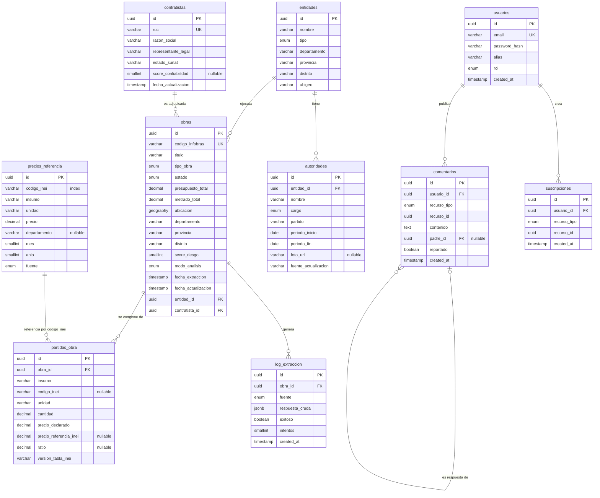

# Modelo de Datos

---

## 1. Diagrama de entidades

El modelo gira en torno a la obra pública, que es la entidad central. A su alrededor se ubican las
partidas de su expediente, la entidad que la ejecuta, el contratista adjudicado y los registros de
extracción. En paralelo viven los precios de referencia, contra los que se comparan las partidas, y las
entidades de participación ciudadana: usuarios, comentarios y suscripciones. El siguiente diagrama
entidad-relación muestra esas tablas y cómo se vinculan.

En el diagrama hay tres vínculos que conviene aclarar:

- `comentarios` se relaciona consigo misma a través de `padre_id`. Es una relación recursiva, no un
  error: un comentario puede ser respuesta de otro, y así se forman los hilos de conversación
  (RF-COM-05). Cuando `padre_id` es nulo, el comentario es de primer nivel.
- `precios_referencia` y `partidas_obra` no se unen por una clave foránea, sino por el campo
  `codigo_inei`. Una misma referencia de precio aplica a muchas partidas.
- `recurso_id` en `comentarios` y `suscripciones` es una referencia polimórfica: apunta a una obra, una
  empresa, un municipio o una autoridad, según el valor de `recurso_tipo`.

---

## 2. Tablas y campos

### obras

| Campo | Tipo | Descripción |
|---|---|---|
| `id` | UUID (PK) | Identificador único |
| `codigo_infobras` | VARCHAR (UQ) | Código único en INFOBRAS |
| `titulo` | VARCHAR | Nombre de la obra |
| `tipo_obra` | ENUM | `edificacion`, `carretera`, `agua_saneamiento`, `educacion`, `salud`, `otros` |
| `estado` | ENUM | `planeado`, `ejecucion`, `concluido`, `paralizado` |
| `presupuesto_total` | DECIMAL(15,2) | Presupuesto total declarado en soles |
| `metrado_total` | DECIMAL(10,2) | Metrado total en m² (para fallback RF-SCO-08) |
| `ubicacion` | GEOGRAPHY(Point) | Coordenadas geográficas (PostGIS) |
| `departamento` | VARCHAR | Departamento |
| `provincia` | VARCHAR | Provincia |
| `distrito` | VARCHAR | Distrito |
| `score_riesgo` | SMALLINT | Score precomputado 0-100 (RF-SCO-05) |
| `modo_analisis` | ENUM | `partidas`, `fallback_m2` (RF-OBR-10) |
| `fecha_extraccion` | TIMESTAMP | Cuándo se extrajeron los datos por última vez |
| `fecha_actualizacion` | TIMESTAMP | Última modificación del registro |
| `entidad_id` | UUID (FK → entidades) | Entidad ejecutora |
| `contratista_id` | UUID (FK → contratistas) | Contratista adjudicado |

**Índices:** GIST sobre `ubicacion` (consultas espaciales · clustering), BTREE sobre `score_riesgo` (filtro), BTREE sobre `departamento`, `tipo_obra`, `estado` (filtros rápidos).

### partidas_obra

| Campo | Tipo | Descripción |
|---|---|---|
| `id` | UUID (PK) | Identificador único |
| `obra_id` | UUID (FK → obras) | Obra a la que pertenece |
| `insumo` | VARCHAR | Nombre del insumo (ej. "Cemento Portland Tipo I") |
| `codigo_inei` | VARCHAR (nullable) | Código estandarizado INEI (para matching) |
| `unidad` | VARCHAR | Unidad de medida (ej. "bolsa", "m³", "kg") |
| `cantidad` | DECIMAL(12,2) | Cantidad declarada |
| `precio_declarado` | DECIMAL(12,2) | Precio unitario declarado en el expediente |
| `precio_referencia_inei` | DECIMAL(12,2) (nullable) | Precio de referencia INEI (última versión disponible) |
| `ratio` | DECIMAL(5,2) (nullable) | `precio_declarado / precio_referencia_inei` |
| `version_tabla_inei` | VARCHAR | Versión/fecha de la tabla INEI usada para el cálculo |

**Índices:** BTREE sobre `obra_id`, BTREE sobre `codigo_inei` (matching).

### precios_referencia

| Campo | Tipo | Descripción |
|---|---|---|
| `id` | UUID (PK) | Identificador único |
| `codigo_inei` | VARCHAR (INDEX) | Código estandarizado del insumo |
| `insumo` | VARCHAR | Nombre del insumo |
| `unidad` | VARCHAR | Unidad de medida |
| `precio` | DECIMAL(12,2) | Precio de referencia en soles |
| `departamento` | VARCHAR (nullable) | Ajuste regional (null = precio nacional) |
| `mes` | SMALLINT | Mes de vigencia (1-12) |
| `anio` | SMALLINT | Año de vigencia |
| `fuente` | ENUM | `inei`, `mvivienda` |

**Índices:** BTREE compuesto sobre `(codigo_inei, departamento, anio, mes)` (matching eficiente).

### contratistas

| Campo | Tipo | Descripción |
|---|---|---|
| `id` | UUID (PK) | Identificador único |
| `ruc` | VARCHAR(11) (UQ) | RUC de la empresa |
| `razon_social` | VARCHAR | Razón social |
| `representante_legal` | VARCHAR | Nombre del representante legal |
| `estado_sunat` | VARCHAR | Estado SUNAT (activo, baja, suspensión temporal, etc.) |
| `score_confiabilidad` | SMALLINT (nullable) | Score precomputado 0-100 (RF-EMP-02) |
| `fecha_actualizacion` | TIMESTAMP | Última actualización |

### entidades

| Campo | Tipo | Descripción |
|---|---|---|
| `id` | UUID (PK) | Identificador único |
| `nombre` | VARCHAR | Nombre de la entidad (ej. "Municipalidad Distrital de X") |
| `tipo` | ENUM | `municipalidad_distrital`, `municipalidad_provincial`, `gobierno_regional`, `ministerio`, `otro` |
| `departamento` | VARCHAR | Departamento |
| `provincia` | VARCHAR | Provincia |
| `distrito` | VARCHAR | Distrito |
| `ubigeo` | VARCHAR(6) | Código UBIGEO |

### autoridades

| Campo | Tipo | Descripción |
|---|---|---|
| `id` | UUID (PK) | Identificador único |
| `entidad_id` | UUID (FK → entidades) | Entidad a la que pertenece |
| `nombre` | VARCHAR | Nombre completo |
| `cargo` | ENUM | `alcalde`, `regidor`, `gobernador`, `consejero`, `otro` |
| `partido` | VARCHAR | Partido / organización política |
| `periodo_inicio` | DATE | Inicio del período |
| `periodo_fin` | DATE | Fin del período |
| `foto_url` | VARCHAR (nullable) | URL de la foto (JNE) |
| `fuente_actualizacion` | VARCHAR | Fuente del dato (ej. "JNE - 2026-06-26") |

### log_extraccion

| Campo | Tipo | Descripción |
|---|---|---|
| `id` | UUID (PK) | Identificador único |
| `obra_id` | UUID (FK → obras) | Obra asociada |
| `fuente` | ENUM | `gemini`, `inei`, `seace`, `sunat`, `jne` |
| `respuesta_cruda` | JSONB | Respuesta completa de la fuente (para auditoría, ADR-001) |
| `exitoso` | BOOLEAN | Si la extracción fue exitosa |
| `intentos` | SMALLINT | Número de intentos realizados |
| `created_at` | TIMESTAMP | Fecha y hora de la extracción |

### usuarios

| Campo | Tipo | Descripción |
|---|---|---|
| `id` | UUID (PK) | Identificador único |
| `email` | VARCHAR (UQ) | Correo electrónico |
| `password_hash` | VARCHAR | Hash de la contraseña (RNF-08) |
| `alias` | VARCHAR | Nombre público visible en comentarios |
| `rol` | ENUM | `anonimo`, `registrado`, `administrador` |
| `created_at` | TIMESTAMP | Fecha de registro |

### comentarios

| Campo | Tipo | Descripción |
|---|---|---|
| `id` | UUID (PK) | Identificador único |
| `usuario_id` | UUID (FK → usuarios) | Autor del comentario |
| `recurso_tipo` | ENUM | `obra`, `empresa`, `municipio`, `autoridad` |
| `recurso_id` | UUID | ID del recurso al que pertenece (FK polimórfica) |
| `contenido` | TEXT | Texto del comentario |
| `padre_id` | UUID (FK → comentarios, nullable) | Comentario padre (respuestas anidadas) |
| `reportado` | BOOLEAN | Si ha sido reportado para moderación (RF-COM-06) |
| `created_at` | TIMESTAMP | Fecha de publicación |

### suscripciones

| Campo | Tipo | Descripción |
|---|---|---|
| `id` | UUID (PK) | Identificador único |
| `usuario_id` | UUID (FK → usuarios) | Usuario suscrito |
| `recurso_tipo` | ENUM | `obra`, `empresa`, `municipio`, `autoridad` |
| `recurso_id` | UUID | ID del recurso suscrito |
| `created_at` | TIMESTAMP | Fecha de suscripción |

**Índice:** BTREE compuesto sobre `(usuario_id, recurso_tipo, recurso_id)` (UQ).

---

## 3. Resumen de relaciones

| Tabla | Relación | Tabla relacionada |
|---|---|---|
| `obras` | N:1 | `entidades` (entidad ejecutora) |
| `obras` | N:1 | `contratistas` (adjudicado) |
| `obras` | 1:N | `partidas_obra` |
| `obras` | 1:N | `log_extraccion` |
| `entidades` | 1:N | `autoridades` |
| `usuarios` | 1:N | `comentarios` |
| `comentarios` | N:1 (self) | `comentarios.padre_id` |
| `usuarios` | 1:N | `suscripciones` |

---

## 4. Convenciones

- **IDs:** UUID v4 (no secuenciales, evita enumeración de recursos).
- **Timestamps:** siempre en UTC con zona horaria (`TIMESTAMPTZ`).
- **Enums:** definidos como tipo ENUM nativo de PostgreSQL.
- **Soft delete:** no aplica (solo datos públicos, comentarios reportados se ocultan).
- **Auditoría:** `log_extraccion` guarda la respuesta cruda de cada fuente para trazabilidad.
